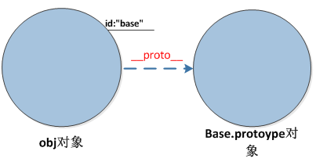

# JS原型链与继承


**Javascript虽然没有继承概念，但Javascript在函数Function对象中建立了原型对象prototype，并以Function对象为主线，从上至下，在内部构建了一条原型链。**

**简单来说就是建立了变量查找机制，当访问一个对象的属性时，先查找对象本身是否存在，如果不存在就去该对象所在的原型连上去找，直到Object对象为止，如果都没有找到该属性才会返回undefined。**

**因此我们经常会利用函数的原型机制来实现JS继承**

## 原型链的关系图：


**1. prototype**

> 这里输入引用文本每个函数都有一个 prototype 属性，就是我们经常在各种例子中看到的那个 prototype ，比如：

```javascript
function Person() {

}
// 虽然写在注释里，但是你要注意：
// prototype是函数才会有的属性
Person.prototype.name = 'Kevin';
var person1 = new Person();
var person2 = new Person();
console.log(person1.name) // Kevin
console.log(person2.name) // Kevin
```

> prototype 属性指向了一个对象，这个对象正是调用该构造函数而创建的实例的原型，也就是这个例子中的 person1 和 person2 的原型。
>
> 什么是原型？ 每一个JavaScript对象\(null除外\)在创建的时候就会与之关联另一个对象，这个对象就是我们所说的原型，每一个对象都会从原型"继承"属性。

**2.proto**

> 这里输入引用文本每一个JavaScript对象\(除了 null \)都具有的一个属性，叫\_\_proto\_\_，这个属性会指向该对象的原型。

```javascript
function Person() {

}
var person = new Person();
console.log(person.__proto__ === Person.prototype); // true
```

**3. constructor**

> 每个原型都有一个 constructor 属性指向关联的构造函数.

```javascript
function Person() {

}
console.log(Person === Person.prototype.constructor); // true
```

**4. 实例与原型**

> 当读取实例的属性时，如果找不到，就会查找与对象关联的原型中的属性，如果还查不到，就去找原型的原型，一直找到最顶层为止。

```javascript
function Person() {

}

Person.prototype.name = 'Kevin';

var person = new Person();

person.name = 'Daisy';
console.log(person.name) // Daisy

delete person.name;
console.log(person.name) // Kevin
```

**5.补充**

```javascript
function Person() {

}
var person = new Person();
console.log(person.constructor === Person); // true
```

> 当获取 person.constructor 时，其实 person 中并没有 constructor 属性,当不能读取到constructor 属性时，会从 person 的原型也就是 Person.prototype 中读取，正好原型中有该属性，所以：

```javascript
person.constructor === Person.prototype.constructor
```

## 如何实现继承？

* 实例继承 instance
* 拷贝继承 copy
* 构造继承 constructor
* 原型继承 prototype。原型继承，就是函数对象的原型= 构造函数

```javascript
function PP(){
  this.pp='爷爷'
}
function AA(){
  this.aa='爸爸'
}
AA.prototype=new PP()
console.info(AA.prototype.pp) //爷爷 .
```

## [js中的new\(\)到底做了些什么？？](https://www.cnblogs.com/faith3/p/6209741.html)

要创建 Person 的新实例，必须使用 new 操作符。以这种方式调用构造函数实际上会经历以下 4  
个步骤：  
\(1\) 创建一个新对象；  
\(2\) 将构造函数的作用域赋给新对象（因此 this 就指向了这个新对象） ；  
\(3\) 执行构造函数中的代码（为这个新对象添加属性） ；  
\(4\) 返回新对象。

**new 操作符**

在有上面的基础概念的介绍之后，在加上new操作符，我们就能完成传统面向对象的class + new的方式创建对象，在[JavaScript](http://lib.csdn.net/base/javascript)中，我们将这类方式成为Pseudoclassical。  
基于上面的例子，我们执行如下代码

```javascript
var obj = new Base();
```



new操作符具体干了什么呢?其实很简单，就干了三件事情。

```javascript
var obj  = {};
obj.__proto__ = Base.prototype;
Base.call(obj);
```

第一行，我们创建了一个空对象obj  
第二行，我们将这个空对象的\_\_proto\_\_成员指向了Base函数对象prototype成员对象  
第三行，我们将Base函数对象的this指针替换成obj，然后再调用Base函数，于是我们就给obj对象赋值了一个id成员变量，这个成员变量的值是”base”，关于call函数的用法

